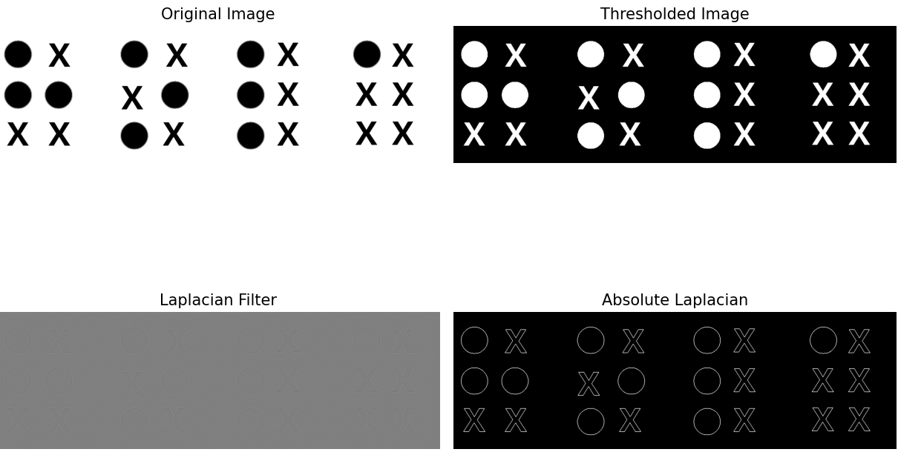
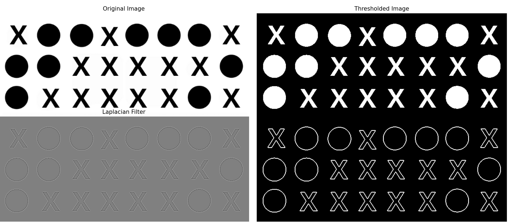

# braille_to_text
Translation from braille to text using image processing.

# Running the program
Follow the next steps:
1- Use git clone to clonate the repository
2- In case you have a MAC you can directly execute the program. Otherwise you will need to change the path in the program to 'hola.png' and 'taco.png'

# get_string function
This function reads an image, applies preprocessing, shows each image in their filtering process and finally extracts the text.

The following image refeers to the filter process to "HOLA" in Braille

The next image refeers to the filter process to "TACO" in Braille

# generate_letters function
Inside this function the program takes a Braille text representation into a matrix.
We generated a single line of a string to substract the correct symbols to match them with their corresponding letter. Also it is shown the matrix of every letter.

# clean_matrix function
Inside this function we replace every symbol that is different of "O" into an "X".

# generate_word function
We take the matrix representation of Braille to convert it into an aplhabetical string. We have a dictionary ready to match every sequence to a letter.